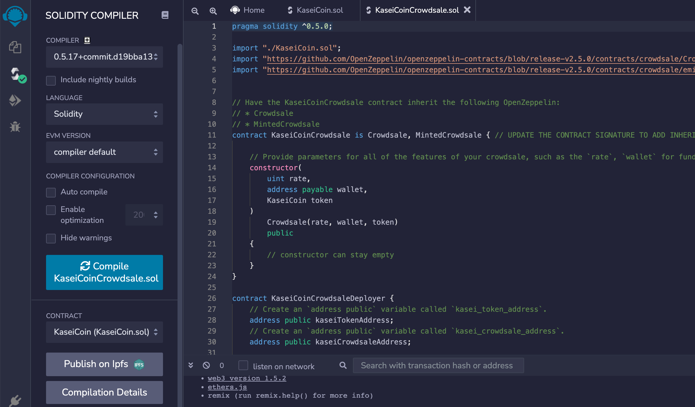

# Fungible Token Application


## Challenge: Martian Token Crowdsale

You will create a fungible token that is ERC-20 compliant and that will be minted by using a `Crowdsale` contract from the OpenZeppelin Solidity library.

The crowdsale contract that you create will manage the entire crowdsale process, allowing users to send ether to the contract and in return receive KAI, or KaseiCoin tokens. Your contract will mint the tokens automatically and distribute them to buyers in one transaction.

### Instructions

The steps for this Challenge are divided into the following sections:

1. Create the KaseiCoin Token Contract

2. Create the KaseiCoin Crowdsale Contract

3. Create the KaseiCoin Deployer Contract

4. Deploy the Crowdsale to a Local Blockchain

5. Optional: Extend the Crowdsale Contract by Using OpenZeppelin

#### Create the KaseiCoin Token Contract

In this section, you will create a smart contract that defines KaseiCoin as an ERC-20 token. To do so, complete the following steps:

1. Import the provided `KaseiCoin.sol` starter file into the Remix IDE.

2. Import the following contracts from the OpenZeppelin library:

    * `ERC20`

    * `ERC20Detailed`

    * `ERC20Mintable`

3. Define a contract for the KaseiCoin token called `KaseiCoin`, and have the contract inherit the three contracts that you just imported from OpenZeppelin.

4. Inside of your `KaseiCoin` contract, add a constructor with the following parameters: `name`, `symbol`, and `initial_supply`.

5. Then, as part of your constructor definition, add a call to the `ERC20Detailed` contract’s constructor, passing the parameters `name`, `symbol`, and `18`. Recall that 18 is the value for the `decimal` parameter.


6. Compile the contract using compiler version 0.5.0.

7. Check for any errors and debug as needed.

8. Take a screenshot of the successful compilation of the contract, and add it to the Evaluation Evidence section of the `README.md` file for your Challenge repository.

#### Create the KaseiCoin Crowdsale Contract

In this section, you will define the KaseiCoin crowdsale contract. To do so, complete the following steps:

1. Import the provided `KaseiCoinCrowdsale.sol` starter code into the Remix IDE.

2. Have this contract inherit the following OpenZeppelin contracts:

* `Crowdsale`

* `MintedCrowdsale`

3. Within the `KaisenCoinCrowdsale` constructor, provide parameters for all of the features of your crowdsale, such as `rate`, `wallet` (where the funds that the token raises should be deposited), and `token`. Configure these parameters as you see fit for your KaseiCoin token.

4. Compile the contract using compiler version 0.5.0.

5. Check for any errors and debug as needed.

6. Take a screenshot of the successful compilation of the contract, and add it to the Evaluation Evidence section of the `README.md` file for your Challenge repository.

#### Create the KaseiCoin Deployer Contract


In this section, you will create the KaseiCoin deployer contract. Start by uncommenting the `KaseiCoinCrowdsaleDeployer` contract in the provided `KaseiCoinCrowdsale.sol` starter code.

Next, within the `KaseiCoinCrowdsaleDeployer` contract, add variables to store the addresses of the `KaseiCoin` and `KaseiCoinCrowdsale` contracts, which this contract will deploy. To do so, complete the following steps:

1. Create an `address public` variable called `kasei_token_address`, which will store `KaseiCoin`’s address once that contract has been deployed.

2. Create an `address public` variable called `kasei_crowdsale_address`, which will store `KaseiCoinCrowdsale`'s address once that contract has been deployed.

3. Add the following parameters to the constructor for the `KaseiCoinCrowdsaleDeployer` contract: `name`, `symbol`, and `wallet`.

4. Inside of the constructor body (between the curly braces), complete the following steps:

    * Create a new instance of the `KaseiCoinToken` contract.

    * Assign the KaseiCoin token contract’s address to the `kasei_token_address` variable. This will allow you to easily fetch the token's address later.

    * Create a new instance of the `KaseiCoinCrowdsale` contract using the following parameters:

       * `rate` (Set `rate` equal to 1 in order to maintain parity with ether.)

       * `wallet` (Pass `wallet` in from the main constructor. This is the wallet that will get paid all of the ether raised by the crowdsale contract.)

       * `token` (This should be the `token` variable where `KaseiCoin` is stored.)

    * Assign the KaseiCoin crowdsale contract’s address to the `kasei_crowdsale_address` variable. This will allow you to easily fetch the crowdsale’s address later.

    * Set the `KaseiCoinCrowdsale` contract as a minter.

    * Have the `KaseiCoinCrowdsaleDeployer` renounce its minter role.

5. Compile the contract using compiler version 0.5.0.

6. Check for any errors and debug as needed.

7. Take a screenshot of the successful compilation of the contract, and add it to the Evaluation Evidence section of the `README.md` file for your Challenge repository.

#### Deploy the Crowdsale to a Local Blockchain

In this section, you will deploy the crowdsale to a local blockchain using Remix, MetaMask, and Ganache. To do so, complete the following steps. Record a short video or take screenshots that illustrate the three steps outlined below as evidence of your deployed crowdsale contract.


1. Deploy the crowdsale to a local blockchain with Remix, MetaMask, and Ganache.

2. Test the functionality of the crowdsale by using test accounts to buy new tokens and then checking the balances associated with those accounts.

3. After purchasing tokens with one or more test accounts, view the total supply of minted tokens and the amount of wei that has been raised in the crowdsale contract.

#### Optional: Extend the Crowdsale Contract by Using OpenZeppelin

In this **optional** section, you may extend the crowdsale contract to enhance its functionality. To do so, you will use the following OpenZeppelin contracts:

* `CappedCrowdsale`: This contract allows you to cap the total amount of ether that may be raised during your crowdsale.

* `TimedCrowdsale`: This contract allows you to set a time limit for your crowdsale by adding an opening time and a closing time.

* `RefundablePostDeliveryCrowdsale`: Every time you launch a crowdsale, you set a goal amount of ether to raise. If the goal is not reached, it is common practice to refund your investors. This contract adds this capability to a crowdsale.

> **Hint** We encourage you to read more about these contracts on the [Crowdsales page](https://docs.openzeppelin.com/contracts/2.x/crowdsales) of the OpenZeppelin documentation.

To enhance your KaseiCoin crowdsale with this added functionality, complete the following steps:

1. Import the three OpenZeppelin contracts described above into the `KaseiCoinCrowdsale.sol` contract by using the following code:

    ```solidity
    import "https://github.com/OpenZeppelin/openzeppelin-contracts/blob/release-v2.5.0/contracts/crowdsale/validation/CappedCrowdsale.sol";
    import "https://github.com/OpenZeppelin/openzeppelin-contracts/blob/release-v2.5.0/contracts/crowdsale/validation/TimedCrowdsale.sol";
    import "https://github.com/OpenZeppelin/openzeppelin-contracts/blob/release-v2.5.0/contracts/crowdsale/distribution/RefundablePostDeliveryCrowdsale.sol";
    ```

2. In addition to the `Crowdsale` and `MintedCrowdsale` contracts, which your contract previously inherited from OpenZeppelin, have your `KaseiCoinCrowdsale` contract inherit the three contracts that you imported in the previous step:

* `CappedCrowdsale`

* `TimedCrowdsale`

* `RefundablePostDeliveryCrowdsale`

3. In the `KaseiCoinCrowdsale` constructor, add the following new parameters:

    * `uint goal`: This variable will represent the amount of ether which you hope to raise during the crowdsale&mdash;the crowdsale’s goal.

    * `uint open`: This variable will represent the opening time for the crowdsale.

    * `uint close`: This variable will represent the closing time for the crowdsale.

4. Complete the `KaseiCoinCrowdsale` constructor code by adding calls to the new contracts, as the following code shows:

    ```solidity
    constructor(
            uint256 rate, // rate in TKNbits
            address payable wallet, // sale beneficiary
            KaseiCoin token, // the KaseiCoin itself that the KaseiCoinCrowdsale will work with
            uint goal, // the crowdsale goal
            uint open, // the crowdsale opening time
            uint close // the crowdsale closing time
        ) public
            Crowdsale(rate, wallet, token)
            CappedCrowdsale(goal)
            TimedCrowdsale(open, close)
            RefundableCrowdsale(goal)
        {
            // constructor can stay empty
        }
    ```

    > **Important** `RefundablePostDeliveryCrowdsale` itself inherits the `RefundableCrowdsale` contract, which requires a `goal` parameter. So, in addition to the others, you must call the `RefundableCrowdsale` constructor from your `KaseiCoinCrowdsale` constructor. `RefundablePostDeliveryCrowdsale` does not have its own constructor, which is why we use the `RefundableCrowdsale` constructor that it inherits.
    >
    > If you forget to call the `RefundableCrowdsale` constructor, the `RefundablePostDeliveryCrowdsale` will fail. This is because it does not have its own constructor, and so it relies on the `RefundableCrowdsale` constructor.

5. Next, update the `KaseiCoinCrowdsaleDeployer` contract to allow the deployment of the updated crowdsale contract. In the constructor of the deployer contract, add a new `uint` parameter called `goal` that will allow you to set the crowdsale goal.

6. In the core assignment, you added an instance of the `KaseiCoinCrowdsale` contract to the KaseiCoin deployer contract. Since we have modified the `KaseiCoinCrowdsale` contract to support new functionality, you must now update your previous code with the following code:

    ```solidity
    KaseiCoinCrowdsale kasei_crowdsale = new KaseiCoinCrowdsale (1, wallet, token, goal, now, now + 24 weeks);
    ```

   Note that in the preceding code, you added values for the three new parameters. The `goal` parameter represents the amount of ether to raise during the crowdsale, `now` represents the crowdsale opening time, and `now + 24 weeks` represents the closing time.

    The `now` function returns the current Ethereum block timestamp in the form of seconds since the Unix epoch. The **Unix epoch** (also known as **Unix time**, **POSIX time**, or **Unix timestamp**) is an integer that represents the number of seconds that have elapsed since January 1, 1970 (midnight UTC/GMT), not counting leap seconds.

7. Compile and test the updated contract by completing following steps:

    * Send ether to the crowdsale from a different account (**not** the same account that is raising funds). Then, once you confirm that the crowdsale works as expected, try to add the token to your wallet and test a transaction.

    * You can set the `close` time to be `now + 5 minutes`, or any timeline that you'd like to test, for a shorter crowdsale.

    * When sending ether to the contract, make sure that you meet the contract’s `goal`. Then, finalize the sale using the `Crowdsale` contract's `finalize` function. To finalize the sale, `isOpen` must return false (`isOpen` comes from `TimedCrowdsale` and checks to see whether the `close` time has passed yet). If you set the `goal` to 300 ether, for example, you may need to purchase tokens from multiple accounts in order to meet the goal. If you run out of pre-funded accounts in Ganache, you can create a new workspace.

    * View your tokens in MetaMask. In MetaMask, click Add Token, then click Custom Token,  and enter the token contract’s address. Make sure to purchase higher amounts of tokens in order to see the denomination appear in your wallet as more than a few wei worth.

## Evaluation Evidence

1 - Screenshot of the successful compilation of the KaseiCoin contract


2 - Screenshot of the successful compilation of KaisenCoinCrowdsale contract.


3 - Screenshot of the succesful compilation of KaseiCoinCrowdsaleDeployer contract.


4 - Screenshot on Ganache of wallet address to receive all Kasei


5 - Watch all contracts depoloyed
